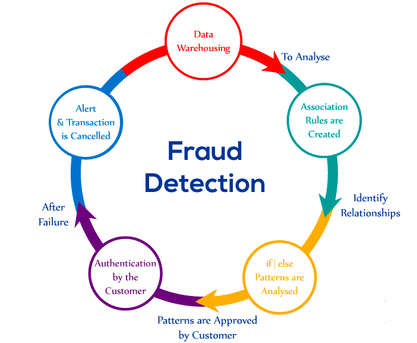

# Credit_Card_Fraud_Detection
Credit card fraud detection is a set of activities that are taken to prevent money via credit card transactions. Credit card fraud loses consumers and financial companies billions of dollars annually. In most companies, fraud is identified after it occurs, In the event that they are unable to prevent it in a timely fashion. Thus, fraud detection systems have become essential for banks and financial institutions to avoid their losses. Here, I have completed the following steps to complete this project.

# 1) Exploratory data analysis:
    1)	Checking the types of data:
    2)	Dropping irrelevant columns:
    3)	Renaming the columns:
    4)	Dropping the duplicate rows:
    5)	Dropping the missing or null values:
    6)	Detecting outliers:
    
# 2)	Data visualization:
# 3)	Identifying the relationships between variables:
# 4)	Hypothesis testing:
# 5) Methodology:
   1)	Logistic regression
   2)	Decision tree
   3)	Random forest
# Built With:

